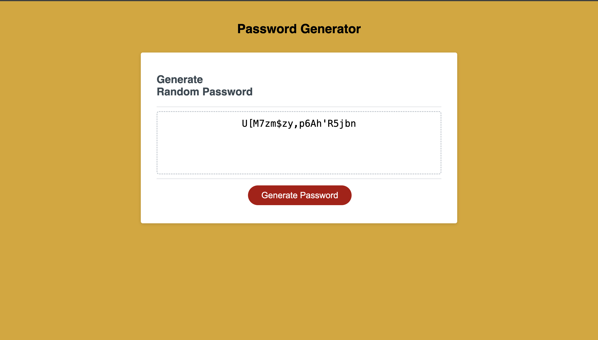
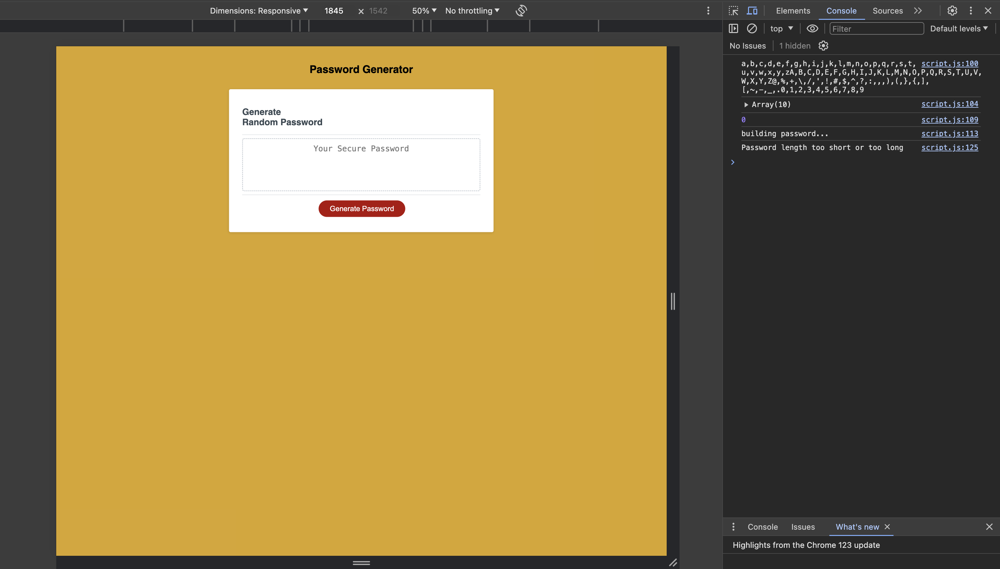
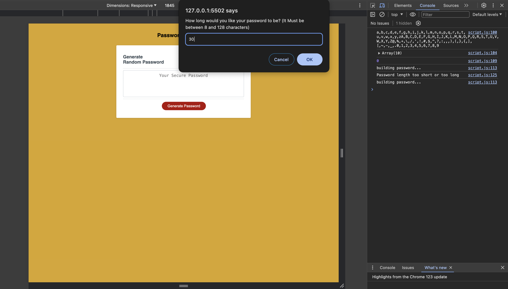
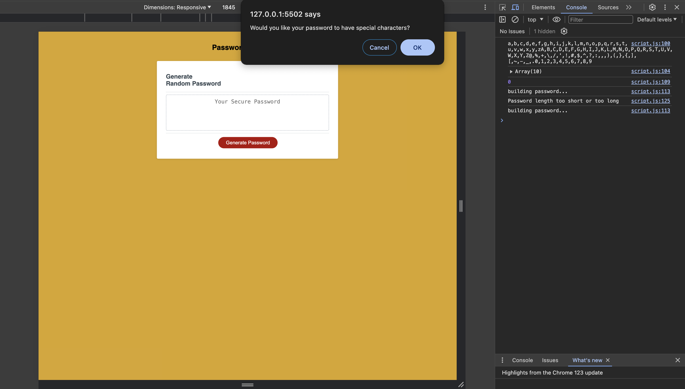
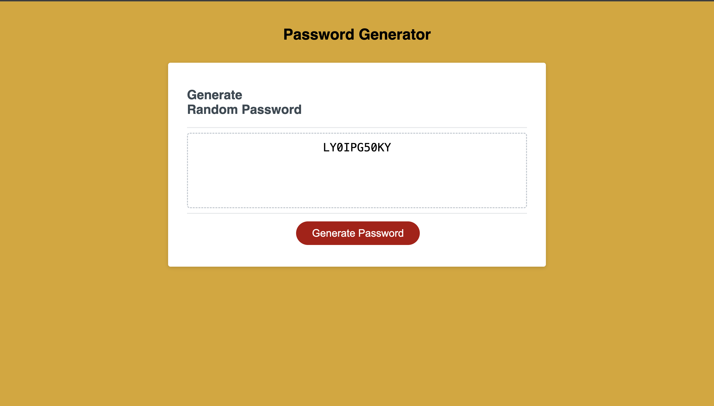

# Counter-Sign

## Description
In this challenge I will be creating a Password Generator application that my employees will be using to generate a random password based on the criteria they have chosen.
When the employee generates their password they can specify how long they would like their password to be, and whether they would like lowercase, uppercase, special characters or numeric characters in their password. All these will be prompts that will appear once they click on the generate password button.

Live link to deployed application [link to deployed application]().

---

## Table of Contents 
* [BuildPassword](#buildpassword)
* [CorrectLength](#correctlength)
* [SpecificCharacters](#specificcharacters)
* [Technologies](#technologies)
* [Credits](#credits)
* [License](#license)

---

## BuildPassword
Once the user clicks on the generate password button a prompt box appears to ask the user for their desired password length. As you can see in the screenshot below the employee put 5 which is too short, an alert box shows up telling the user that the password length must be between 8 & 128 characters. The third screenshot also shows console log message is the password is too long or short. 

User entered password number less than 8 

Alert!

Console.log 

---

## CorrectLength
When the user clicks the generate button and enters a password length that is between 8 & 128 characters. A couple prompt boxes appear asking if the user wants to add lowercase, uppercase, numerical or special characters to their password and if the user says okay to all. A password is generated that includes all the characters.

Prompt box asking user for password length

Prompt box to ask user if they want special characters

30 character length generated password

---

## SpecificCharacters
This screenshot shows that a user can opt out of including certain characters to their password. For example if a user wants a 10 character length password and chooses to cancel the special and lowercase character prompts, and select okay to the uppercase and numeric characters, their password will only consist of uppercase and numeric characters.

10 length password with uppercase & numeric characters

---

## Technologies
* JavaScript
* CSS
* HTML

## Credits
* Esther Babirye
* Brandon Leek
* Samuel Cordova

## License
MIT License

Copyright (c) 2024 estherbab

Permission is hereby granted, free of charge, to any person obtaining a copy
of this software and associated documentation files (the "Software"), to deal
in the Software without restriction, including without limitation the rights
to use, copy, modify, merge, publish, distribute, sublicense, and/or sell
copies of the Software, and to permit persons to whom the Software is
furnished to do so, subject to the following conditions:

The above copyright notice and this permission notice shall be included in all
copies or substantial portions of the Software.

THE SOFTWARE IS PROVIDED "AS IS", WITHOUT WARRANTY OF ANY KIND, EXPRESS OR
IMPLIED, INCLUDING BUT NOT LIMITED TO THE WARRANTIES OF MERCHANTABILITY,
FITNESS FOR A PARTICULAR PURPOSE AND NONINFRINGEMENT. IN NO EVENT SHALL THE
AUTHORS OR COPYRIGHT HOLDERS BE LIABLE FOR ANY CLAIM, DAMAGES OR OTHER
LIABILITY, WHETHER IN AN ACTION OF CONTRACT, TORT OR OTHERWISE, ARISING FROM,
OUT OF OR IN CONNECTION WITH THE SOFTWARE OR THE USE OR OTHER DEALINGS IN THE
SOFTWARE.

---

---

© 2023 edX Boot Camps LLC. Confidential and Proprietary. All Rights Reserved.

