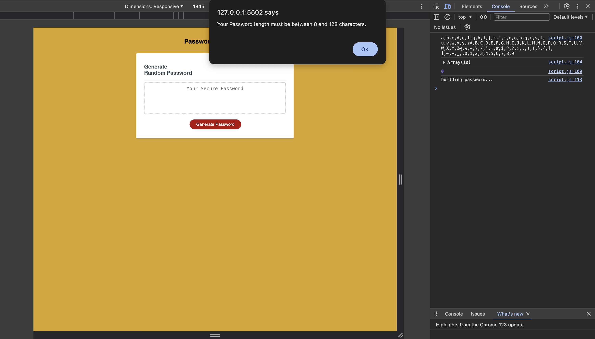

# Counter-Sign

## Description
In this challenge I will be creating a Password Generator application that my employees will be using to generate a random password based on the criteria they have chosen.
When the employee generates their password they can specify how long they would like their password to be, and whether they would like lowercase, uppercase, special characters or numeric characters in their password. All these will be prompts that will appear once they click on the generate password button.

Live link to deployed application [link to deployed application]().

---

## Table of Contents 
* [BuildPassword](#buildpassword)
* [CorrectLength](#correctlength)
* [SpecificChars](#specificchars)
* [Usage](#usage)
* [Technologies](#technologies)
* [Credits](#credits)
* [License](#license)

---

## BuildPassword
Once the user clicks on the generate password button a prompt box appears to ask the user for their desired password length. As you can see in the screenshot below the employee put 5 which is too short, an alert box shows up telling the user that the password length must be between 8 & 128 characters. The third screenshot also shows console log message is the password is too long or short. 

---

## CorrectLength
When the user clicks the generate button and enters a password length that is between 8 & 128 characters. A couple prompt boxes appear asking if the user wants to add lowercase, uppercase, numerical or special characters to their password and if the user says okay to all. A password is generated that includes all the characters.

